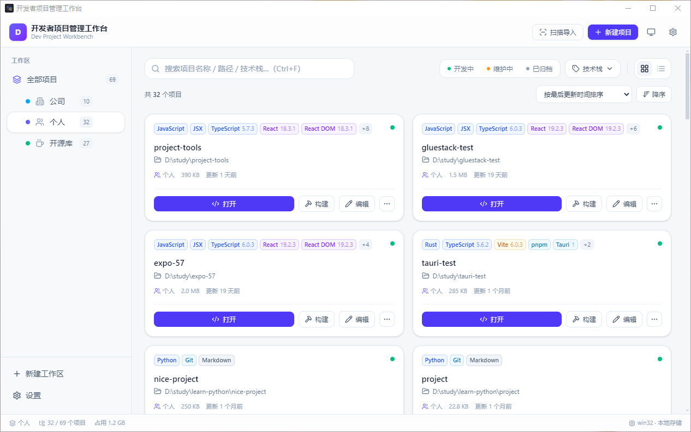

<div align="center">

# Dev Project Workbench · 开发者项目管理工作台

**统一管理本地开发项目 · 自动识别技术栈 · 一键打开编辑器 · 一键打包构建**

[English](./README.en.md) · [简体中文](./README.md)


</div>



---

## 目录

- [项目简介](#项目简介)
- [核心功能](#核心功能)
- [环境要求](#环境要求)
- [安装与使用](#安装与使用)
- [配置项说明](#配置项说明)
- [项目结构](#项目结构)
- [贡献指南](#贡献指南)
- [常见问题解答](#常见问题解答)
- [许可证](#许可证)

---

## 项目简介

**Dev Project Workbench（开发者项目管理工作台）** 是一款面向开发者的本地项目管理工具。它把你散落在磁盘各处的项目集中到一个界面里，自动识别每个项目的技术栈，并支持一键用编辑器打开、一键执行构建命令。

如果你经常在多个项目之间切换、记不清某个仓库到底是 Vue 还是 React、每次打包都要先 `cd` 半天——这个工具就是为此而生的。

### 设计约束与架构

「打开编辑器」和「执行构建」依赖 Node.js 的 `child_process`，浏览器无法直接完成。因此项目采用 **Vite 前端 + 本地 Express 后端** 的单体结构，而不是纯静态应用。

| 层 | 技术选型 | 说明 |
| :--- | :--- | :--- |
| 前端 | React 18 + TypeScript + Vite 6 + Tailwind CSS v4 | 组件化、类型安全、原子化样式 |
| 状态管理 | Zustand | `projectStore` / `workspaceStore` / `settingsStore` |
| 路由 | React Router 6 | `/` 工作台、`/settings` 设置 |
| 后端 | Express 4（本地服务，端口 `5177`） | 目录扫描、技术栈检测、编辑器唤起、构建执行 |
| 存储 | 本地 JSON 文件 | 数据不出本机，支持导出 / 导入备份 |

两种运行模式的差异：

| 模式 | 启动命令 | 访问地址 | 说明 |
| :--- | :--- | :--- | :--- |
| 开发模式 | `npm run dev` | `http://localhost:5173` | Vite 提供 HMR，通过代理将 `/api` 转发到后端 |
| 生产模式 | `npm run serve` | `http://127.0.0.1:5177` | Express 单端口同时托管 API 与 `dist` |

---

## 核心功能

### 项目管理

- **多工作区**：默认提供「个人 / 公司 / 开源」三个工作区，支持增删改、**拖拽排序**、图标与主题色自定义
- **聚合视图**：「全部项目」汇总所有工作区，各工作区实时显示项目数量
- **项目 CRUD**：支持新建、编辑、移除，状态标记（开发中 / 维护中 / 已归档）
- **双视图**：网格卡片与紧凑列表一键切换
- **灵活排序**：自定义（拖拽）、名称、名称拼音、最后更新时间、创建时间、项目体积，均支持升序 / 降序
- **批量导入**：扫描目录批量导入项目，自动跳过 `node_modules`、`.git`、`dist` 等目录

### 技术栈可视化

- **自动识别**六大类技术：语言（TypeScript / JavaScript / Python / Go / Rust / Java…）、前端框架（React / Vue / Angular / Svelte / Next / Nuxt…）、后端（Express / NestJS / Prisma…）、构建工具（Vite / Webpack / Rollup / Maven…）、包管理器（npm / yarn / pnpm / bun）、工具（Git / Docker / ESLint / Jest…）
- **版本号提取**：从 `package.json` 读取真实版本，短包名优先（如 `vite` 优先于 `@vitejs/plugin-react`）
- **标签即筛选**：点击任意技术标签即可按该技术过滤项目

### 项目详情

- 右侧详情抽屉：路径、所属工作区、体积、创建时间、最后更新时间、描述、构建命令
- 技术栈按分类分组展示
- 最近一次 Git 提交信息（本机需安装 Git）

### 快速操作

- **一键打开**：内置 VS Code / Cursor / Trae / WebStorm / IDEA / Sublime / Zed / Notepad++ / Vim 等 13 种编辑器，自动检测是否已安装，支持添加自定义编辑器
- **一键打包**：SSE 实时日志流、耗时统计、可中途终止、完成后通知
- **其他操作**：在文件管理器中显示、在终端中打开、复制项目路径、刷新技术栈
- **右键菜单**：卡片 / 列表项右键唤起完整操作菜单

### 检索与交互

- **搜索**：项目名称 / 路径 / 技术栈 / 描述，支持模糊匹配
- **过滤**：状态 + 技术栈 + 工作区，多条件组合（多技术栈为 AND 语义）
- **快捷键**：`Ctrl/⌘ + F` 搜索、`Ctrl/⌘ + N` 新建项目、`Ctrl/⌘ + S` 设置
- **主题**：深色 / 浅色 / 跟随系统，响应式适配桌面、平板、移动端

---

## 环境要求

| 项目 | 要求 |
| :--- | :--- |
| Node.js | **>= 18**（推荐 20 LTS） |
| npm | >= 9（随 Node 附带） |
| Git | 可选。安装后才能显示「最近提交」信息 |
| 操作系统 | Windows 10+ / macOS 10.14+ / Ubuntu 18.04+ |

> Windows 平台功能最完整（如目录选择器支持盘符枚举），其他平台核心功能一致。

---

## 安装与使用

### 快速开始

```bash
# 1. 克隆仓库
git clone https://github.com/<your-username>/dev-project-workbench.git
cd dev-project-workbench

# 2. 安装依赖
npm install

# 3. 开发模式启动（前端热更新 + 后端 --watch 自动重启）
npm run dev
```

打开 `http://localhost:5173` 即可使用。首次启动时后端会自动创建默认数据（3 个默认工作区 + 0 个项目）。

### 可用脚本

| 命令 | 说明 |
| :--- | :--- |
| `npm run dev` | 开发模式。并发启动后端（5177，`--watch`）与 Vite（5173） |
| `npm run build` | 仅构建前端产物到 `dist/` |
| `npm run start` | 仅启动后端，托管已有的 `dist` |
| `npm run serve` | 生产模式。先构建再以 `NODE_ENV=production` 启动，单端口 `http://127.0.0.1:5177` |
| `npm run typecheck` | TypeScript 类型检查（`tsc --noEmit`） |

> `npm run start`：目录 `dist` 是否存在只在启动时判定一次，构建后需重启服务才会生效。生产部署请直接使用 `npm run serve`。

### 打包为桌面应用（Electron）

应用依赖 Node 的 `child_process` 能力，无法纯浏览器分发。通过 Electron 可将前端 `dist` 与本地 Express 后端一起打包为桌面应用，**用户无需安装 Node 即可运行**。

**原理**：Electron 主进程本身就是 Node 运行时，直接加载 `server/index.js` 拉起后端监听 `127.0.0.1:5177`，主窗口加载该地址；数据目录通过 `DWB_DATA_DIR` 注入到 `app.getPath('userData')/data`，避免写入只读的 asar 资源目录。

```bash
# 本地调试 Electron（先构建前端，再拉起桌面窗口）
npm run electron:dev

# 打包 Windows 可执行文件
npm run dist:win             # 同时产出 NSIS 安装版与便携版
npm run dist:win:nsis        # 仅 NSIS 安装版（推荐分发）
npm run dist:win:portable    # 仅单文件便携版（免安装）
```

产物输出到 `release/`：

| 文件 | 说明 |
| :--- | :--- |
| `DevProjectWorkbench-<version>-Setup.exe` | NSIS 安装版，可自定义安装路径、创建桌面快捷方式 |
| `DevProjectWorkbench-<version>-portable.exe` | 便携版，免安装，双击即运行 |

> - 首次 `npm install` 需下载 Electron 二进制，网络受限时可配置镜像：`$env:ELECTRON_MIRROR="https://npmmirror.com/mirrors/electron/"`
> - 打包体积约 80–150 MB，属 Electron 正常水平
> - 自定义应用图标：将 `icon.ico` 放入 `assets/`，并在 `electron-builder.yml` 的 `win.icon` 中指定

---

## 配置项说明

### 应用设置

设置页面（`/settings`）中的选项，持久化在 `server/data/store.json`：

| 配置项 | 类型 | 默认值 | 说明 |
| :--- | :--- | :--- | :--- |
| `theme` | `light` \| `dark` \| `system` | `system` | 主题模式，同时写入 localStorage 键 `dwb.theme` 以避免首屏闪烁 |
| `defaultEditorId` | `string` | `vscode` | 默认编辑器 ID，「打开」操作使用它 |
| `buildCommand` | `string` | `npm run build` | 默认构建命令，可在单个项目中覆盖 |
| `viewMode` | `grid` \| `list` | `grid` | 默认视图模式 |
| `sortBy` | `custom` \| `name` \| `pinyin` \| `lastUpdated` \| `createdAt` \| `size` | `custom` | 排序字段。`custom` 下启用拖拽排序 |
| `sortDir` | `asc` \| `desc` | `asc` | 排序方向 |
| `scanMaxDepth` | `number` | `3` | 目录扫描最大深度，值越大越慢 |
| `confirmBeforeBuild` | `boolean` | `true` | 执行构建前是否弹出确认 |

### 环境变量

| 变量 | 默认值 | 说明 |
| :--- | :--- | :--- |
| `PORT` | `5177` | 后端监听端口（Electron 主进程同样读取它） |
| `NODE_ENV` | — | 设为 `production` 时 Express 托管 `dist` 静态资源 |
| `DWB_DATA_DIR` | `server/data` | 数据存储目录。Electron 打包后自动指向 `userData/data` |
| `ELECTRON_MIRROR` | — | Electron 二进制下载镜像，仅安装 / 打包阶段需要 |

### 快捷键

| 快捷键 | 功能 |
| :--- | :--- |
| `Ctrl / ⌘ + F` | 聚焦搜索框 |
| `Ctrl / ⌘ + N` | 新建项目 |
| `Ctrl / ⌘ + S` | 打开设置 |
| `Esc` | 关闭弹窗 / 抽屉 |

### 数据存储

- 位置：`server/data/store.json`（已加入 `.gitignore`）
- **删除该文件即恢复初始状态**（3 个默认工作区 + 0 个项目）
- 写入采用防抖 120 ms +「先写 `.tmp` 再 `rename`」的原子替换策略
- 设置页面支持**导出 / 导入 JSON** 做备份与迁移

---

## 项目结构

```
.
├── server/                     # 本地 Express 后端（原生 ESM，无构建步骤）
│   ├── index.js                # 全部 /api 路由与静态资源托管
│   ├── store.js                # 本地 JSON 持久化（防抖写盘 + 原子替换）
│   └── services/
│       ├── projectScanner.js   # 目录递归扫描与项目识别
│       ├── techStackDetect.js  # 技术栈检测 / 体积统计 / Git 信息
│       ├── editorCommands.js   # 编辑器与文件管理器唤起（跨平台）
│       └── buildRunner.js      # 构建任务执行与日志推送（SSE）
├── src/
│   ├── components/             # UI 组件（Modal / ProjectCard / WorkspaceNav …）
│   ├── pages/                  # Dashboard / Settings
│   ├── stores/                 # Zustand 状态：project / workspace / settings / toast
│   ├── hooks/                  # 快捷键、项目操作
│   ├── lib/                    # API 客户端、格式化、筛选排序、图标
│   └── types/                  # TypeScript 类型定义
├── electron/
│   └── main.js                 # Electron 主进程，内嵌启动后端
├── assets/                     # 应用图标
├── doc/
│   └── PRD-1.0.0.md            # 产品需求文档
└── electron-builder.yml        # 桌面端打包配置
```

---

## 贡献指南

欢迎提交 Issue 与 Pull Request。开始前请先阅读以下约定。

### 开发流程

```bash
git checkout -b feat/your-feature
# ... 开发与提交 ...
npm run typecheck    # 必须零错误
npm run build        # 必须构建成功
```

> 项目未配置测试框架与 linter，提交前请**至少**通过 `npm run typecheck` 与 `npm run build`；涉及后端改动时，请用 `curl.exe` 验证 `api/health`、`api/bootstrap` 及改动涉及的路由。

### 代码约定

| 主题 | 约定 |
| :--- | :--- |
| 路径别名 | `@/*` 在 `tsconfig.json` 的 `paths` **和** `vite.config.ts` 的 `resolve.alias` 各配了一份，改别名必须同时改两处 |
| 后端错误 | 同步路由直接 `throw` 带 `status` 的错误；**异步路由必须包 `asyncHandler`**，否则 rejection 会变成未处理 Promise |
| 组件扩展 | `ProjectCard` 与 `ProjectListItem` 共用 `components/projectShared.ts` 的 `ProjectViewProps`，新增展示字段两边都要改 |
| 项目操作 | 全部收敛在 `hooks/useProjectActions.tsx`（**是 `.tsx`，内含 JSX**），右键菜单与详情页共用同一份菜单定义 |
| 样式表 | `lib/format.ts` 集中了 `STATUS_META` / `CATEGORY_META` / `WORKSPACE_COLORS`，状态与技术栈配色改这里 |
| Tailwind v4 | 深色模式依赖 `<html>` 上的 `.dark` 类，**不要**使用 v3 的 `darkMode: 'media'` 配置 |
| 新增写操作 | store 读取函数返回内部对象引用，直接 mutate 会生效，但记得调用 `persist()` |
| 编辑器缓存 | 增删自定义编辑器后必须调用 `clearEditorCache()` |

---

## 常见问题解答

<details>
<summary><strong>项目数据存在哪里？会上传到服务器吗？</strong></summary>

全部保存在本机的 `server/data/store.json`，**不会上传到任何服务器**。导入 / 导出功能同样只在本机进行。
</details>

<details>
<summary><strong>如何重置到初始状态？</strong></summary>

删除 `server/data/store.json` 并重启服务即可恢复初始状态（3 个默认工作区 + 0 个项目）。建议先通过设置页导出一份备份。
</details>

<details>
<summary><strong>「移除项目」会删除磁盘上的文件吗？</strong></summary>

不会。移除操作只删除工作台中的记录，磁盘文件保持原样。
</details>

<details>
<summary><strong>为什么需要跑一个本地后端？纯静态不行吗？</strong></summary>

不行。「一键打开编辑器」和「一键打包」依赖 Node.js 的 `child_process`，浏览器沙箱无法执行本地进程。这是本项目采用本地 Express 后端的根本原因。
</details>

<details>
<summary><strong>端口 5177 被占用怎么办？</strong></summary>

设置环境变量 `PORT` 指定其他端口。开发模式下还需同步修改 `vite.config.ts` 中 `/api` 的代理目标地址。

```powershell
$env:PORT = "5178"; npm run start
```
</details>

<details>
<summary><strong>编辑器没有被自动检测到？</strong></summary>

检测通过 `where`（Windows）/ `command -v`（macOS / Linux）探测可执行文件，因此编辑器必须已加入 `PATH`。未检测到的编辑器仍可手动选择使用；若是自定义路径安装的编辑器，可在设置中添加自定义编辑器。
</details>

<details>
<summary><strong>构建时提示 <code>npm</code> / <code>pnpm</code> 命令不存在？</strong></summary>

构建在项目根目录执行，并已自动将 `node_modules/.bin` 注入 `PATH`。Windows 下以 `shell: true` 启动以正确解析 `npm.cmd` / `yarn.cmd` / `pnpm.cmd`。若仍失败，请确认对应包管理器已全局安装且位于 `PATH` 中。
</details>

<details>
<summary><strong>最近提交信息不显示？</strong></summary>

该功能需要本机安装 Git，且项目必须是 Git 仓库。非 Git 目录会静默跳过；读取超时也会返回 `null` 而不报错。
</details>

<details>
<summary><strong>技术栈识别不准确或缺少某个框架？</strong></summary>

识别规则集中在 `server/services/techStackDetect.js` 的 `DEP_TECH`（依赖名映射）与 `FILE_TECH`（文件 / 配置映射）两张表，补充相应条目即可。也可在项目卡片上右键选择「刷新技术栈」重新检测。

注意：依赖按**包名长度升序**处理，以保证 `vite` 的版本优先于 `@vitejs/plugin-react`。
</details>

<details>
<summary><strong>目录扫描很慢，或者漏掉了一些项目？</strong></summary>

扫描在命中 `PROJECT_MARKERS`（`package.json`、`go.mod`、`Cargo.toml` 等 20 个标志文件）后即停止下钻，并以后置并发池补全技术栈。若扫描过慢可调低 `scanMaxDepth`；若深层项目被漏掉可适当调高该值。无权限访问的目录会被静默跳过。
</details>

<details>
<summary><strong>为什么构建日志要用 SSE 加轮询两种方式？</strong></summary>

SSE 的 `log` 事件只推送增量文本，服务端 `job.logs` 才是权威来源（内存任务表最多保留 20 个任务、单任务日志上限 3000 行）。前端同时以 1.2 秒轮询 `GET /api/builds/:id` 做补齐，避免断流导致日志缺失。
</details>

<details>
<summary><strong>Windows 上终止构建任务为什么要用 <code>taskkill</code>？</strong></summary>

单纯的 `process.kill()` 杀不掉 Windows 下的子进程树（例如 `npm.cmd` 派生出的实际构建进程），因此 `stopBuild()` 在 Windows 使用 `taskkill /pid /t /f` 终止整棵进程树。
</details>

<details>
<summary><strong>Electron 安装 / 打包时下载二进制很慢？</strong></summary>

配置镜像后重新安装：

```powershell
$env:ELECTRON_MIRROR = "https://npmmirror.com/mirrors/electron/"
npm install
```
</details>

---

## 许可证

本项目基于 **[MIT License](./LICENSE)** 开源发布。

你可以自由地使用、复制、修改、合并、发布、分发、再许可及销售本软件的副本，唯一条件是**在所有副本或实质性部分中保留上述版权声明与许可声明**。

本软件按「原样」提供，不作任何明示或暗示的担保，包括但不限于适销性、特定用途适用性与非侵权性的担保。无论因合同、侵权或其他原因，作者或版权持有人均不对任何索赔、损害或其他责任负责。

完整条款见 [LICENSE](./LICENSE) 文件。

---

<div align="center">

如果这个项目对你有帮助，欢迎点个 ⭐ Star 支持一下。

</div>
